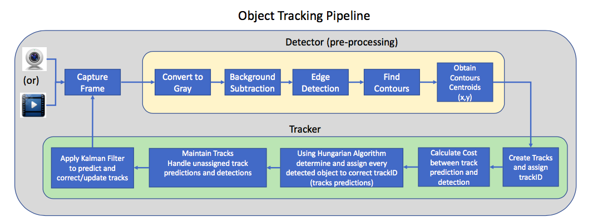
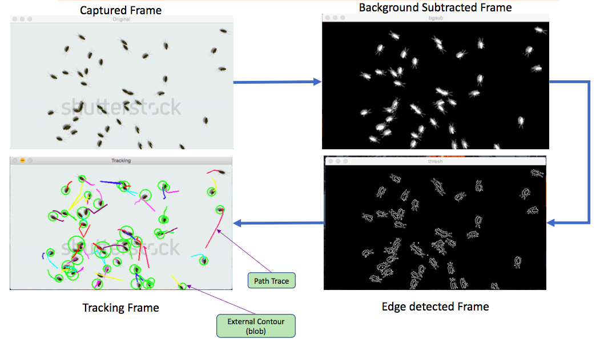

Multi Object Tracker Using Kalman Filter & Hungarian Algorithm
----
- Author: Pritesh Raj  
- Date: 21/12/2020

- Usage:  
$ python3.7 objectTracking.py  

- Design:  

  

- Output:  

  

- Pre-requisite:  
    - Python 3.7  
    - Numpy  
    - SciPy  
    - Opencv